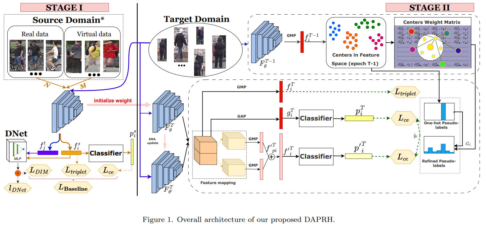

# DAPRH : GAN-based Data Augmentation and Pseudo-Label Refinement with Holistic Features for Unsupervised Domain Adaptation Person Re-Identification

Official PyTorch implementation of [GAN-based Data Augmentation and Pseudo-Label Refinement with Holistic Features for Unsupervised Domain Adaptation Person Re-Identification]() submitted to Knowledge-Based Systems journal (2023).

# Updates
*   [05/2023] Push Initial rep on Github and Release unofficial code, results, pretrained models
*   [__/____] Citation, official code (when the paper is accepted)

# Overview




# Getting Started

## Installation
```bash
git clone https://github.com/ewigspace1910/DAPRH.git
conda create --name DAPRH
conda activate DAPRH 
pip install -r requirements.txt
```

## Installation
1. Download the object re-ID datasets Market-1501, Duke-MTMC, MSMT17 from [here](https://github.com/michuanhaohao/reid-strong-baseline/tree/master), then move to /datasets. The directory should look like:

```
DAPRH/data
├── Market-1501-v15.09.15
├── DukeMTMC-reID
├── MSMT17
|── ....
├── 4Gan #(Must be created)
└── SystheImgs #(Must be created)
```

2. To prepare data for GAN, we setup into /datasets/4Gan as following:

```
DAPRH/data/4Gan
├── duke2market
|   ├──train
|   |   ├──dukemtmc
|   |   ├──market1501c0
|   |   ├──market1501c1
|   |   ├──market1501c2
|   |   ├──market1501c3
|   |   ├──market1501c4
|   |   ├──market1501c5
|   ├──test
|   |   ├──dukemtmc
|   |   ├──market1501c0
|   |   ├──market1501c1
|   |   ├──market1501c2
|   |   ├──market1501c3
|   |   ├──market1501c4
|   |   ├──market1501c5
├── market2duke
|   ├──...
├── ...
```

# Training
We utilize 1 Tesla T4 GPU 16G for training. 
We use 256x128 sized images for Market-1501, DukeMTMC and MSMT17 in both Training-GAN and Training-Reid

- For convenient, we utilize bash script to setup commands. You can reuse or modify them in './DAPRH/scripts'

## Training-GAN
- setup env
```bash
cd DAPRH/stargan
conda activate DAPRH
```

- for duke-->market:
```bash
# Train StarGAN on custom datasets
LABEL_DIM=7
CROP_SIZE=128
IMG_SIZE=128
TRAIN_IMG_DIR="../../datasets/ReidGan/duke2mark/train"
BATCHSIZE=16
Lidt=1
Lrec=10
Lgp=10
Lcls=1
python main.py --mode train --dataset RaFD --rafd_crop_size $CROP_SIZE --image_size $IMG_SIZE \
               --c_dim $LABEL_DIM --rafd_image_dir $TRAIN_IMG_DIR --batch_size $BATCHSIZE\
               --sample_dir ../../saves/Gan-duke2mark/samples \
               --log_dir ../../saves/Gan-duke2mark/logs \
               --model_save_dir ../../saves/Gan-duke2mark/models \
               --result_dir ../../saves/Gan-duke2mark/results \
               --lambda_idt $Lidt \
               --lambda_rec $Lrec \
               --lambda_gp $Lgp --lambda_cls $Lcls
```

- for market-->duke:
```bash
# Train StarGAN on custom datasets
LABEL_DIM=7
CROP_SIZE=128
IMG_SIZE=128
TRAIN_IMG_DIR="../../datasets/ReidGan/market2duke/train"
BATCHSIZE=16
Lidt=1
Lrec=10
Lgp=10
Lcls=1
python main.py --mode train --dataset RaFD --rafd_crop_size $CROP_SIZE --image_size $IMG_SIZE \
               --c_dim $LABEL_DIM --rafd_image_dir $TRAIN_IMG_DIR --batch_size $BATCHSIZE\
               --sample_dir ../../saves/Gan-mark2duke/samples \
               --log_dir ../../saves/Gan-mark2duke/logs \
               --model_save_dir ../../saves/Gan-mark2duke/models \
               --result_dir ../../saves/Gan-mark2duke/results \
               --lambda_idt $Lidt \
               --lambda_rec $Lrec \
               --lambda_gp $Lgp --lambda_cls $Lcls
```

- After training, we can use trained-GAN models to gen synthetic datasets for reID :

```bash
# 4 duke2market
LABEL_DIM=7
CROP_SIZE=128
IMG_SIZE=128
TRAIN_IMG_DIR="../../datasets/4Gan/duke2mark/train/dukemtmc"
FAKEDIR="../../datasets/SyntheImgs/duke2mark" #!!!!
BATCHSIZE=1 #!!!!
ITER=200000
DOMAIN=0
python main.py --mode sample --dataset RaFD --rafd_crop_size $CROP_SIZE --image_size $IMG_SIZE \
               --c_dim $LABEL_DIM --rafd_image_dir $TRAIN_IMG_DIR --batch_size $BATCHSIZE\
               --sample_dir ../../saves/Gan-duke2mark/samples \
               --log_dir ../../saves/Gan-duke2mark/logs \
               --model_save_dir ../../saves/Gan-duke2mark/models \
               --result_dir ../../saves/Gan-duke2mark/results \
               --test_iters $ITER --except_domain=$DOMAIN \ #!!!!
               --pattern "{ID}_{CX}_f{RANDOM}.jpg" \ #!!!!
               --gen_dir $FAKEDIR #!!!!
#############################
# market4duke
LABEL_DIM=7
CROP_SIZE=128
IMG_SIZE=128
TRAIN_IMG_DIR="../../datasets/4Gan/mark2duke/train/dukemtmc"
FAKEDIR="../../datasets/SyntheImgs/mark2duke"
BATCHSIZE=1
ITER=200000
DOMAIN=6
python main.py --mode sample --dataset RaFD --rafd_crop_size $CROP_SIZE --image_size $IMG_SIZE \
               --c_dim $LABEL_DIM --rafd_image_dir $TRAIN_IMG_DIR --batch_size $BATCHSIZE\
               --sample_dir ../../saves/Gan-mark2duke/samples \
               --log_dir ../../saves/Gan-mark2duke/logs \
               --model_save_dir ../../saves/Gan-mark2duke/models \
               --result_dir ../../saves/Gan-mark2duke/results \
               --test_iters $ITER --except_domain=$DOMAIN \
               --pattern "{ID}_{CX}_f{RANDOM}.jpg" \
               --gen_dir $FAKEDIR

```

## Training-ReID
- activate env
```
cd DAPRH
conda activate DAPRH
```

### Phase 1: Pretrain
- training on lable domain **with** both real and fake images + DIM:
```bash
#for example
python _source_pretrain.py \
    -ds "dukemtmc" -dt "market1501" \
    -a "resnet50"  --iters 200 \
	--num-instances 16 -b 128 --margin 0.3 \
    --warmup-step 10 --lr 0.00035 --milestones 40 70  --epochs 80 --eval-step 1 \
	--logs-dir "../saves/reid/duke2market/S1/R50Mix"  \
    --data-dir "../datasets" \
    --fake-data-dir "../datasets/SystheImgs"   \
    --ratio 4 1 \
    --dim --lamda 0.05

python _source_pretrain.py \
    -dt "dukemtmc" -ds "market1501" \
    -a "resnet50" --iters 200 \
	--num-instances 16 -b 128  --margin 0.3 \
    --warmup-step 128 --lr 0.00035 --milestones 40 70  --epochs 80 --eval-step 1 \
	--logs-dir "../saves/reid/market2duke/S1/R50Mix"  \
    --data-dir "../datasets" \
    --fake-data-dir "../datasets/SystheImgs"   \
    --ratio 4 1 \
    --dim --lamda 0.05
```

* Note: U can modify file `./modules/datasets/synimgs.py` in line `ndict` to adapt stucture of path to Fake Image Folder.

### Phase 2: Finetune
- Modify the below script to excute:
```bash
###              DUKE ---> MARKET              ####
 
python _target_finetune.py \
-dt "market1501" -b 128  --num-instances 16 \
-a resnet50 --epochs 26 --iters 400 --npart 2 \
--logs-dir "../saves/reid/duke2market/S2/finetune"   \
--init "../saves/reid/duke2market/S1/R50Mix/model_best.pth.tar" \
--data-dir "../datasets" \
--pho 0   --uet-al 0.8  \
--ece 0.4 --etri 0.6 --ema

###              MARKET ---> DUKE              ####

python _target_finetune.py \
-dt "dukemtmc" -b 128 --num-instances 16 \
-a resnet50 --epochs 26 --iters 400  --npart 2 \
--logs-dir "../saves/reid/market2duke/S2/finetune"   \
--init "../saves/reid/market2duke/S1/R50Mix/model_best.pth.tar" \
--data-dir "../datasets" \
--gtri-weight 1 --gce-weight 1 
--pho 0.   --uet-al 0.5  \
--ece 0.4 --etri 0.6 --ema 
```

- for convenience, you can use directly scripts in `./DAPRH/scripts`

### Evaluate
```bash
python test_model.py \
-dt "market1501" --data-dir "../datasets" \
-a resnet50 --features 0  -b 128 \
--resume ".../model_best.pth.tar" \
--rerank #optional
```

## Results


- you can also download pretrained model from [modelrepo](https://github.com/ewigspace1910/modelrepo)

## Citation
If you find this code useful for your research, please consider citing our paper
````BibTex

````

